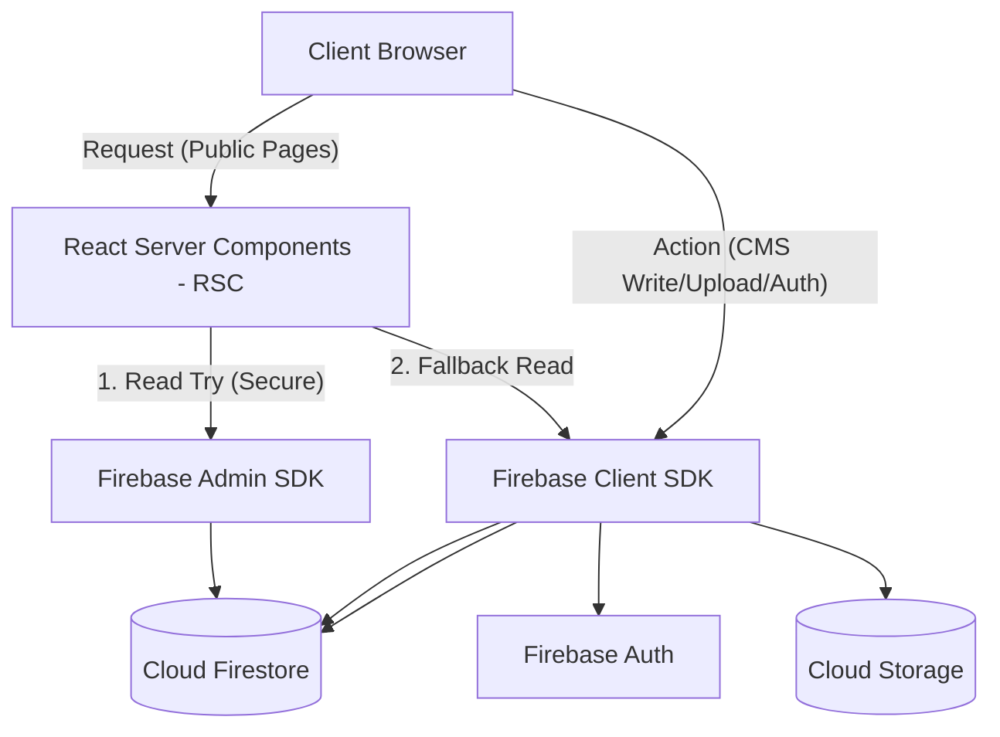

# Project Context: Green Riverside Cosy Home

This document serves as the central context and developer knowledge base for the **Green Riverside Cosy Home** codebase. It outlines the tech stack, directory structure, route definitions, data flow, integrations, and critical files to ensure future modifications adhere to the system's design and code conventions.

---

## 1. Technology Stack

The project is structured around a modern, performance-oriented stack:

*   **Core Framework**: Next.js `16.2.9` (utilizing App Router) with React `19.2.4`.
*   **Styling**: Tailwind CSS `v4` with PostCSS. Class merges are handled through standard utility helpers:
    *   `clsx`
    *   `tailwind-merge`
    *   `class-variance-authority` (CVA)
*   **Database & Storage**: Google Firebase (`12.14.0`) & Firebase Admin SDK (`14.0.0`):
    *   **Firestore**: Primary NoSQL database.
    *   **Cloud Storage**: Media assets (optimized and stored as `.webp`).
    *   **Authentication**: Admin and editor login management.
*   **Form & Validation**: `react-hook-form` (`7.79.0`) coupled with `zod` (`4.43.0`) schema validation.
*   **Visual Elements & Interactivity**:
    *   `framer-motion` (`12.40.0`): Micro-animations and page transitions.
    *   `lucide-react` (`1.18.0`): Icon system.
    *   `sonner` (`2.0.7`): Toast notifications for CMS feedback.
*   **Text Editing (CMS)**: TipTap (`3.26.1`) rich-text editor components.
*   **Brochure Generator**: `docx` (`9.7.1`) for generating PDF/Word downloadable brand documentation.

---

## 2. Directory Structure

```
green-riverside-cosy-home/
├── docs/                           # Documentation and static specs
│   └── FIRESTORE_SCHEMA.md         # Firestore collection schemas
├── public/                         # Static assets (images, icons, manifests)
├── scripts/                        # Database scripts and utility tasks
│   ├── content/                    # Data processing sub-scripts
│   ├── create-admin.mjs            # CLI script to create CMS administrators
│   ├── seed-via-auth.mjs           # Populates Firestore collections
│   └── generate-brand-brochure.mjs # Compilation script for docx brochures
├── src/                            # Application source code
│   ├── app/                        # Next.js App Router directories
│   │   ├── [locale]/               # Localized public routes (en/vi)
│   │   ├── admin/                  # CMS administration pages
│   │   ├── blog/                   # Public blog dynamic path fallback structures
│   │   ├── stay/                   # Public stay dynamic path structures
│   │   ├── tours/                  # Public tours dynamic path structures
│   │   ├── globals.css             # Base design tokens and CSS variables
│   │   ├── layout.tsx              # Root HTML wrapper
│   │   ├── robots.ts               # Crawler access parameters
│   │   └── sitemap.ts              # Dynamic XML sitemap generator
│   ├── components/                 # React UI elements
│   │   ├── admin/                  # CMS forms and login wrappers
│   │   ├── layout/                 # Global Navbar, Footer, and SiteBrand
│   │   ├── seo/                    # Schema injection (JsonLd)
│   │   ├── ui/                     # Design primitives (Buttons, Inputs, etc.)
│   │   └── whatsapp/               # WhatsApp conversion trigger buttons
│   ├── hooks/                      # Custom hooks (useWhatsApp, useAdminLoader)
│   ├── lib/                        # Business logic layer
│   │   ├── cms/                    # Page intro/hero metadata resolution
│   │   ├── data/                   # Server side services mapping
│   │   ├── firebase/               # Firebase Admin / Client initialization engines
│   │   ├── i18n/                   # Translation and metadata configurations
│   │   └── seo.ts                  # JSON-LD Schema definitions
│   ├── messages/                   # Translation dictionaries (en/vi)
│   ├── services/                   # Client-side CRUD commands for CMS
│   └── types/                      # TypeScript schemas & Normalization functions
├── firebase.json                   # Firebase Deployment configurations
├── firestore.rules                 # Database write safety validation
├── storage.rules                   # Cloud Storage write safety validation
└── next.config.ts                  # Next.js dev parameters and image origins
```

---

## 3. Main Routes

The application splits routing into two logical zones: **Public Web Pages** (which are fully localized) and the **Admin CMS Dashboard** (protected by Authentication).

### A. Localized Public Routes (`src/app/[locale]/`)
All public routes are structured inside a `[locale]` dynamic folder representing the language segment (supporting `en` and `vi`):

*   **Homepage (`/`)**: Main landing page displaying previews of rooms, tours, gallery, blog, activities, and reviews.
*   **Our Story (`/our-story`)**: Narrative and timeline for family-run hospitality.
*   **Stay (`/stay` & `/stay/[slug]`)**: Room & dorm listing and description detail views.
*   **Eat & Drink (`/eat-drink`)**: Rooftop Café details, highlighted foods, drinks, and reservation options.
*   **Explore Phong Nha (`/explore-phong-nha`)**: General guides on local areas, motorbike tours, and valleys.
*   **Tours (`/tours` & `/tours/[slug]`)**: Tour packages, itineraries, timelines, prices, and bookings.
*   **Social Activities (`/social-activities`)**: Weekly calendar of social events (e.g., Family Dinner, Happy Hour).
*   **Transport (`/transportation`)**: Booking transport transfers (airport, train, sleeping buses).
*   **Gallery (`/gallery`)**: Image board categorized by topic (Sunset, Cafe, Nature, etc.).
*   **Blog (`/blog` & `/blog/[slug]`)**: Travel guides and destination instructions.
*   **Contact (`/contact`)**: Customer details, direct location maps, and unified FAQs.
*   **Legal Policies (`/terms` & `/privacy`)**: Standard service agreements.

### B. Admin CMS Routes (`src/app/admin/`)
Used by administrators and editors to update the website content in real time:

*   **Dashboard Index (`/admin`)**: Aggregated metrics of active rooms, tours, reviews, blog posts, and gallery images.
*   **Page Content Configs**:
    *   `/admin/homepage`: Hero headers, Why Choose points, and CTAs.
    *   `/admin/story`: Timeline highlights and narrative content.
    *   `/admin/cafe`: Menu listing highlights, photos, and descriptions.
    *   `/admin/faq`: Global website FAQs.
    *   `/admin/pages`: Page-specific intro text, banners, and layout labels.
*   **Collection Editors**:
    *   `/admin/rooms`: Create/Update/Delete rooms, rates, occupancy, and amenities.
    *   `/admin/tours`: Manage guided trips, checklists, schedules, and costs.
    *   `/admin/activities`: Weekly scheduling and icons.
    *   `/admin/transportation`: Transport rates and routes.
    *   `/admin/gallery`: Manage media uploads and category sorting.
    *   `/admin/blog`: Write travel columns using TipTap rich text.
    *   `/admin/reviews`: Manage testimonial cards.
*   **Global Settings (`/admin/settings`)**: Contact info, SEO presets, and WhatsApp configurations.
*   **Auth Entrance (`/admin/login`)**: Secure admin email/password login portal.

---

## 4. Data Flow & Integrations



### Data Retrieval Architecture (Dual Read Fallback)
Public pages retrieve data on the server side using React Server Components (RSC). To read securely and bypass Firestore rules configuration issues during runtime, the app implements a fallback pattern in [server-firestore.ts](file:///d:/green-riverside-cosy-home/src/lib/firebase/server-firestore.ts):

1.  **Firebase Admin Read**: If service account variables (`FIREBASE_ADMIN_CLIENT_EMAIL` and `FIREBASE_ADMIN_PRIVATE_KEY`) are present in `.env.local`, the server loads the Admin SDK ([admin-firestore.ts](file:///d:/green-riverside-cosy-home/src/lib/firebase/admin-firestore.ts)) to query Firebase directly.
2.  **Firebase Client Read (Fallback)**: If Admin credentials are missing or fail, the system falls back to querying Firestore using the public Client SDK ([firestore.ts](file:///d:/green-riverside-cosy-home/src/lib/firebase/firestore.ts)).

### How Pages Fetch Data
*   **Static Page Resolution**: Localized pages utilize `generateStaticParams()` on slug paths (e.g. `stay/[slug]`, `tours/[slug]`, `blog/[slug]`) to pre-generate paths during static builds.
*   **Localized Dictionary Resolution**: Path checking middleware logic maps routes into corresponding dictionaries (`messages/en.json` or `messages/vi.json`) using `getPageContext()` in [get-dictionary.ts](file:///d:/green-riverside-cosy-home/src/lib/i18n/get-dictionary.ts).
*   **Aggregated Server Page Service**: [services.ts](file:///d:/green-riverside-cosy-home/src/lib/data/services.ts) maps direct functions (`getRooms()`, `getSiteSettings()`, `getBlogPostBySlug(slug)`) as a centralized data layer for React Server Components.

---

## 5. Critical Files to Know

When planning code updates, keep these core orchestration files in mind:

1.  **[proxy.ts](file:///d:/green-riverside-cosy-home/src/proxy.ts)**: Intercepts standard route paths, analyzes localization cookies (`gr-locale`), and routes path variables to localized parameters (`/[locale]`).
2.  **[server-firestore.ts](file:///d:/green-riverside-cosy-home/src/lib/firebase/server-firestore.ts)**: Chooses between the server-side Admin SDK or client SDK fallback for database calls.
3.  **[services.ts](file:///d:/green-riverside-cosy-home/src/lib/data/services.ts)**: Central data fetcher for RSC, combining dynamic database values with fallback schemas.
4.  **[config.ts](file:///d:/green-riverside-cosy-home/src/lib/firebase/config.ts)**: Configures Firestore collections mapping targets (`rooms`, `tours`, `reviews`, etc.) and Storage folders.
5.  **[storage.ts](file:///d:/green-riverside-cosy-home/src/lib/firebase/storage.ts)**: Client-side storage manager, featuring a HTML5 Canvas image compression utility that automatically scales and converts uploads to optimized WebP.
6.  **[get-dictionary.ts](file:///d:/green-riverside-cosy-home/src/lib/i18n/get-dictionary.ts)**: Handles lazy-loaded imports for translations.
7.  **[index.ts](file:///d:/green-riverside-cosy-home/src/types/index.ts)**: Main types database containing standard data interface models and default normalizers (e.g. `normalizeHomepage`).
8.  **[seo.ts](file:///d:/green-riverside-cosy-home/src/lib/seo.ts)**: Formats Google Search parameters and maps items into structured JSON-LD schemas (Hotel, Restaurant, Tour, Breadcrumb, and BlogPosting).
